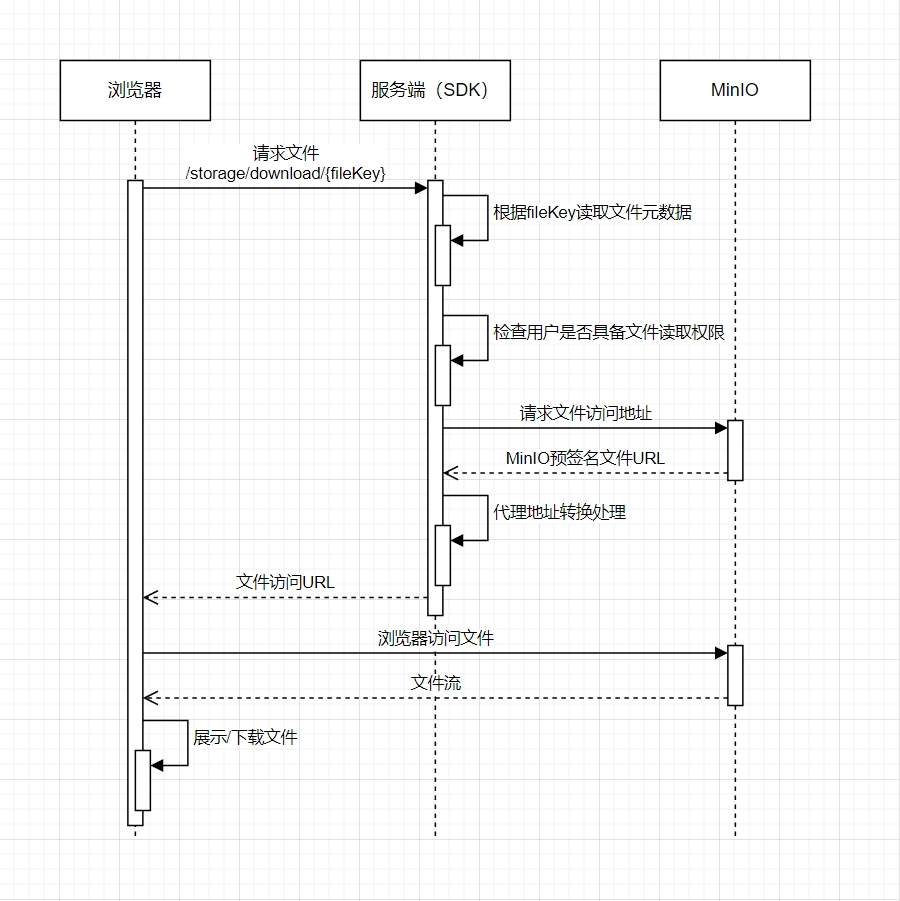
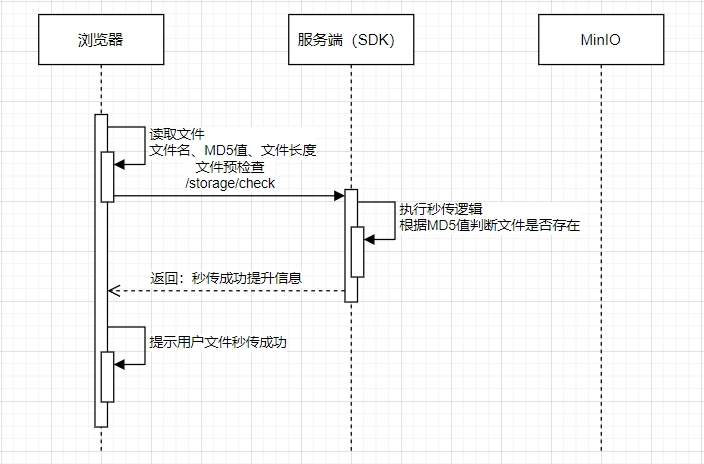

# 简介 | Intro

[MinIO-Plus](https://github.com/lxp135/minio-plus/) 是一个 [MinIO](https://github.com/minio/minio) 的二次封装与增强工具，在 MinIO 的基础上只做增强，不侵入 MinIO 代码，只为简化开发、提高效率而生。成为 MinIO 在项目中落地的润滑剂。

> 我们的愿景是成为 MinIO 最好的搭档。

# 特性 | Feature

* **无侵入** ：只做增强不做改变，引入它不会对现有工程产生影响，如丝般顺滑。
* **文件秒传** ：对每个上传的文件进行哈希摘要识别，用户上传同一个文件时，没有文件实际传输过程，做到秒传。
* **并发上传** ：将文件切分为小块。同时并发上传多个小块，最大限度地利用带宽，加快上传速度。
* **断点续传** ：在传输过程中遇到问题导致传输失败，只需重新传输未完成的小块，而不需要重新开始整个传输任务。
* **缩略图生成** ：识别文件类型，在图片上传时自动生成缩略图，缩略图大小可配置。
* **自动桶策略** ：按照文档、压缩包、音频、视频、图片等类型自动建桶，按照`/年/月`划分路径，避免受到操作系统文件目录体系影响导致性能下降。
* **访问权限控制** ：可支持基于用户、组的文件权限控制，保证重要文件的安全性。
* **访问链接时效** ：基于 MinIO 的临时链接创建策略，提供具备有效期并预签名的上传与下载地址。
* **前端直连** ：前端直连 MinIO ，项目工程不做文件流的搬运，在支持以上特性的情况下提供 MinIO 原生性能。

# 设计 | Design

项目定位是一个SDK，非独立部署服务，并支持spring-boot自动装配。
用户自行实现数据存储部分，项目仅提供MySQL默认实现。

## 文件下载

浏览器向服务端发起文件读取请求，服务端会根据fileKey入参取得文件的元数据信息。获取文件元数据信息后，根据元数据信息中的是否私有字段和所有者字段判断是否具备文件读取权限。

* 当用户具备读取权限时，服务端请求MinIO服务器获取经过预签名的文件访问地址返回给浏览器。
* 当用户不具备读取权限时，返回给浏览器无访问权限提示信息。

浏览器拿到真实文件地址后，读取文件并显示或下载。

## 文件上传

## 文件秒传

当用户重复上传相同的文件时，每次都需要执行一次完整的文件上传操作，这造成了文件上传过程的冗余，即浪费了用户的时间和服务器的网络IO，重复文件又占用了不必要的服务器磁盘空间。
针对以上两个问题，minio-plus支持文件秒传特性，解决了传统文件上传中重复文件上传时的问题，提高了文件传输的效率和用户体验，同时减少了文件服务器的存储空间占用。
实现文件秒传的技术问题主要涉及文件唯一标识的生成和文件重复性检测。

* 文件唯一标识生成：在浏览器端，使用MD5哈希算法对待传输文件进行哈希值编码。编码结果为一字符串，作为文件的唯一标识。
* 文件重复性检测：在服务器端，根据接收到的文件唯一标识在数据库中进行搜索。如果在数据库中找到相同的文件唯一标识，那么判断该文件存在且无需再进行文件传输。
* 文件传输：如果在服务器端未找到相同的文件唯一标识，那么浏览器端开始正常地将文件传输至服务器。

# 代码托管

代码托管在 [https://github.com/lxp135/minio-plus](https://github.com/lxp135/minio-plus/) 仓库中，jar 发布到 Maven 中央仓库。

# 版权 | License

[Apache License 2.0](https://www.apache.org/licenses/LICENSE-2.0)

# 参与贡献

* 刘小平 contact@liuxp.me

